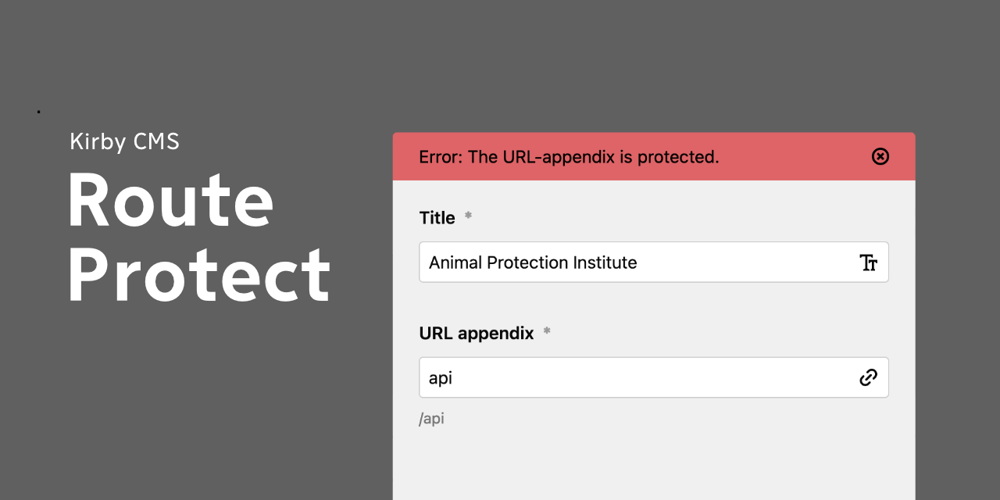

# Kirby 3 Route Protect plugin

A [Kirby 3](https://getkirby.com) plugin, protecting panel user from creating page URL in conflict with routes.

**Version tested:** 3.9.0

## Installation

### Download

Download and copy this repository to `/site/plugins/kirby-route-protect`.

### Git submodule

	git submodule add https://github.com/andreasnymark/kirby-route-protect.git site/plugins/kirby-route-protect

## Use

The plugin automatically picks all routes in the project, both custom and Kirby routes. You can add your own in **site/config/config.php**

	return [
		'andreasnymark.kirby-route-protect' => [
			'slugs' => [ 'protected-word' ],
		]
	];

## Disclaimer

This plugin is provided "as is" with no guarantee. Use it at your own risk and always test it yourself before using it in a production environment. If you find any issues, please create [a new issue](//github.com/andreasnymark/kirby-route-protect/issues/new).

## License

[MIT](https://opensource.org/licenses/MIT)

You are prohibited from using this plugin in any project that promotes racism, sexism, homophobia, animal abuse, violence or any other form of hate speech.

